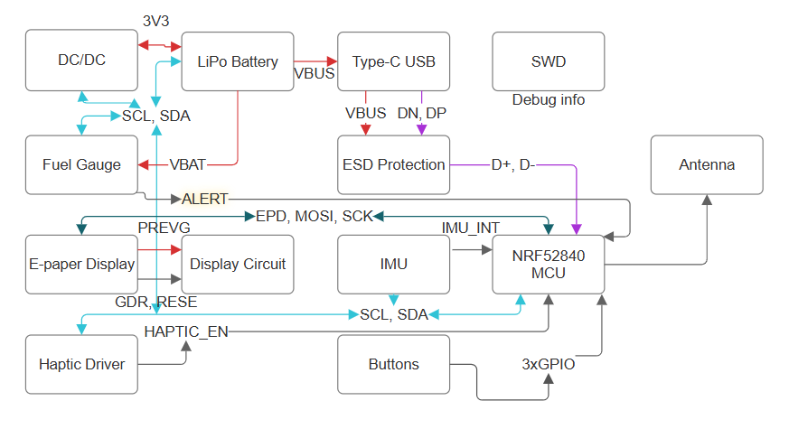

# Proiect TSC 2026 - InkTime

Răducu Ioan Ștefan 335CA

## Descriere proiect
InkTime este un dispozitiv open source de tip smartwatch construit în cadrul clasei de proiectare hardware din UNSTPB. Device-ul are integrat un MCU nRF52840, senzori IMU și un display E-paper într-o carcasă compactă. Designul consideră aspectele legate de consum minim de energie și optimizarea PCB-ului pentru producție.

## Schema bloc

Se pot vedea în schema bloc componentele conectate prin săgeți. Săgețile au următoarele semnificații:
- **roșu** - trasee de putere
- **albastru deschis** - conexiuni I2C
- **albastru închis** - conexiuni SPI
- **mov** - trasee diferențiale
- **gri** - conexiuni GPIO sau fără a aparține categoriilor de mai sus

## Bill of Materials

| Componentă / Valoare | Cant. | Capsulă | Producător / Part Number | Sursă Achiziție (JLC/Mouser) | Datasheet |
| :--- | :---: | :--- | :--- | :--- | :--- |
| **nRF52840** | 1 | aQFN-73 | Nordic / nRF52840-QIAA | [Mouser Link](https://www.mouser.ro/c/?q=nRF52840) | [Datasheet](https://infocenter.nordicsemi.com/pdf/nRF52840_PS_v1.1.pdf) |
| **BMA423** | 1 | 12-pin LGA | Bosch / BMA423 | [Mouser Link](https://www.mouser.co.uk/ProductDetail/Bosch-Sensortec/BMA423?qs=HXFqYaX1Q2xC%252BSgeGoX3mg%3D%3D) | [Datasheet](https://www.bosch-sensortec.com/media/boschsensortec/downloads/datasheets/bst-bma423-ds004.pdf) |
| **BQ25180YBGR** | 1 | BGA-8 | TI / BQ25180YBGR | [Mouser Link](https://www.mouser.co.uk/ProductDetail/Texas-Instruments/BQ25180YBGR?qs=doiCPypUmgEWjAK%252BJAX6Tw%3D%3D) | [Datasheet](https://www.ti.com/lit/ds/symlink/bq25180.pdf) |
| **MAX17048G+T10** | 1 | TDFN-8 | Analog Devices / MAX17048 | [Mouser Link](https://www.mouser.ro/Search/Refine?Keyword=MAX17048G%2BT10) | [Datasheet](https://datasheets.maximintegrated.com/en/ds/MAX17048-MAX17049.pdf) |
| **DRV2605YZFR** | 1 | BGA-9 | TI / DRV2605YZFR | [Mouser Link](https://www.mouser.ro/Search/Refine?Keyword=DRV2605YZFR) | [Datasheet](https://www.ti.com/lit/ds/symlink/drv2605.pdf) |
| **RT6160AWSC** | 1 | WLCSP-15 | Richtek / RT6160AWSC | [Mouser Link](https://www.mouser.co.uk/ProductDetail/Richtek/RT6160AWSC?qs=amGC7iS6iy%2FLd9PSoixZXQ%3D%3D) | [Datasheet](https://www.richtek.com/assets/product_file/RT6160/DS6160-03.pdf) |
| **2450AT18B100E** | 1 | 3216 (1206) | Johanson / Antenă 2.45GHz | [Mouser Link](https://www.mouser.co.uk/ProductDetail/Johanson-Technology/2450AT18B100E?qs=yCnrNFeXz%252Bh5MFsFIXGZGA%3D%3D) | [Datasheet](https://www.johansontechnology.com/datasheets/2450AT18B100E/2450AT18B100E.pdf) |
| **744043680 (L4)** | 1 | 4.8x4.8mm | Wurth / 68µH Inductor | [JLC Part](https://jlcpcb.com/partdetail/Wurth_Elektronik-744043680/C167448) | [Datasheet](https://www.we-online.com/catalog/datasheet/744043680.pdf) |
| **FTC252012SR47** | 1 | 2520 (1008) | TDK / 0.47µH Inductor | [JLC Part (C5832368)](https://jlcpcb.com/partdetail/6763488-FTC252012SR47MBCA/C5832368) | [Datasheet](https://product.tdk.com/en/system/files/dam/doc/product/inductor/inductor/smd/catalog/inductor_commercial_power_ftc252012s_en.pdf) |
| **503480-2400** | 1 | FPC-24 | Molex / Conector EPD | [Mouser Link](https://www.mouser.co.uk/ProductDetail/Molex/503480-2400?qs=OAhjpuo3Vu7efIoxFh9AOw%3D%3D) | [Datasheet](https://www.molex.com/pdm_docs/sd/5034802400_sd.pdf) |
| **USB-C 16P** | 1 | SMT | Kinghelm / KH-TYPE-C-16P | [JLC Part](https://jlcpcb.com/partdetail/Kinghelm-KH_TYPE_C_16P/C5186522) | [Datasheet](https://datasheet.lcsc.com/lcsc/2112151030_Kinghelm-KH-TYPE-C-16P_C2930266.pdf) |
| **EVP-AKE31A** | 3 | SMT (Buton) | Panasonic / Tactile SW | [Mouser Link](https://www.mouser.ro/Search/Refine?Keyword=EVP-AKE31A) | [Datasheet](https://industrial.panasonic.com/ww/products/pt/tactile-sw/models/EVPAKE31A) |
| **USBLC6-2SC6Y** | 1 | SOT-23-6 | ST / Protecție ESD | [JLC Part](https://jlcpcb.com/partdetail/STMicroelectronics-USBLC6_2SC6Y/C7519) | [Datasheet](https://www.st.com/resource/en/datasheet/usblc6-2.pdf) |
| **MBR0530** | 3 | SOD-123 | ON Semi / Schottky 0.5A | [JLC Part](https://jlcpcb.com/partdetail/onsemi-MBR0530T1G/C2131) | [Datasheet](https://www.onsemi.com/pdf/datasheet/mbr0530t1-d.pdf) |
| **SI1308EDL** | 1 | SC-70-3 | Vishay / N-Ch MOSFET | [Mouser Link](https://www.mouser.ro/Search/Refine?Keyword=SI1308EDL) | [Datasheet](https://www.vishay.com/docs/72013/si1308edl.pdf) |
| **DMG2305UX-7** | 1 | SOT-23 | Diodes Inc / P-Ch MOSFET | [JLC Part](https://jlcpcb.com/partdetail/Diodes_Incorporated-DMG2305UX_7/C128526) | [Datasheet](https://www.diodes.com/assets/Datasheets/DMG2305UX.pdf) |

### Rezistente si condensatoare

| Valoare | Cant. | Capsulă | Tip | JLC |
| :--- | :---: | :--- | :--- | :--- |
| **1uF / 50V** | 10 | 0402 | Condensator (EPD) | [C52923](https://jlcpcb.com/partdetail/Samsung_Electro_Mechanics-CL05A105KB5NQNC/C52923) |
| **10uF** | 4 | 0402 | Condensator | [C15525](https://jlcpcb.com/partdetail/Samsung_Electro_Mechanics-CL05A106MQ5NUNC/C15525) |
| **100nF** | 5 | 0201 | Condensator | [C1619](https://jlcpcb.com/partdetail/Murata_Electronics-GRM033R61A104KE84D/C1619) |
| **10K** | 6 | 0201 | Rezistență | [C25744](https://jlcpcb.com/partdetail/Yageo-RC0201JR_0710KL/C25744) |
| **5.1K (5K1)** | 2 | 0201 | Rezistență (USB CC) | [C25785](https://jlcpcb.com/partdetail/Yageo-RC0201JR_075K1L/C25785) |
| **3.3K (3K3)** | 2 | 0201 | Rezistență | [C25891](https://jlcpcb.com/partdetail/Yageo-RC0201JR_073K3L/C25891) |

## Funcționalități hardware

Pentru următoarele funcționalități hardware se vor folosi numele circuitelor așa cum sunt reprezentate în schematic. La conectarea cu alte circuite se vor menționa circuitele cu semnalele puse în paranteză, lângă menționarea lor.

### LiPo Battery
Circuitul LiPo battery este conectorul către baterie. El este amplasat aproape de circuitul **DC/DC (VREG, 3V3)** și **Fuel Gauge (3V3, VBAT)**, formând un ansamblu. Acest ansamblu este amplasat lângă **E-Paper Connector** și **USB Connector (VBUS)** pentru a izola zonele care se ocupă cu traseele de putere sau au putere mare de restul componentelor, pentru a evita interferențele. Este conectat la microcontroler prin protocolul I2C.

### Fuel Gauge
Circuitul Fuel Gauge se ocupă cu măsurarea nivelului bateriei și alertarea microprocesorului când bateria este descărcată. El este conectat la microcontroler prin protocolul I2C și semnalul **ALERT** (probabil folosit ca întrerupere).

### DC/DC
Circuitul DC/DC este adaptorul de tensiune al PCB-ului. El trimite semnale de putere folosind PWM pentru a regla tensiunea. Este conectat la procesor prin protocolul I2C.

### E-Paper Connector
Circuitul E-Paper Connector este conexiunea la ecranul E-Paper. El este conectat la microcontroler prin protocolul SPI. Semnalele care sunt conectate la microcontroler sunt **EPD_BUSY, EPD_RST, EPD_DC, EPD_CS, SCK și MOSI**. El este conectat și la circuitul **E-Paper Drive Circuit** prin PREVGH, PREVGL și 3V3.

### E-Paper Drive Circuit
Circuitul E-Paper Drive "crește” semnalul pentru modelarea cernelii pentru ecranul E-Paper. El este plasat direct lângă **E-Paper Display Connector** datorită semnalului puternic de putere (până la 50V) pe care îl transmite ecranului. Astfel, ansamblul de putere menționat mai devreme, conectorul E-Paper și acest circuit sunt puse apropiat pentru a nu interfera cu restul PCB-ului.

### USB-C Connector
Circuitul USB-C Connector reprezintă mufa USB. Este conectat la ansamblul de putere (VBUS) și la circuitul **ESD Protection (VBUS, DN, DP)**. Deși în designul PCB-ului DN și DP ar trebui să fie trasee diferențiale, ele nu sunt. Am luat această decizie datorită poziției apropiate a USB-C Connector față de circuitul ESD Protection. El este conectat la microcontroler prin semnalul VBUS și indirect, prin ESD Protection, prin semnalele diferențiale D+ și D-.

### ESD Protection
Circuitul ESD Protection reprezintă protecția mufei USB-C în cazul descărcărilor statice. El este conectat la **USB-C Connector (VBUS, DN, DP)** și la microcontroler (D+, D- trasee diferențiale). În designul PCB-ului, semnalele D+ și D- au aceeași lungime.

### SWD
Circuitul SWD este folosit pentru debugging și este conectat la semnalele importante (**RESET, 3V3 și GND**). Poate fi conectat la JTAG.

### Haptic Driver
Circuitul Haptic Driver este cel responsabil de vibrația ceasului. El este conectat la microcontroler prin protocolul I2C și semnalul **HAPTIC_EN**. În PCB, el este situat la distanță de IMU pentru a nu interfera cu acesta în momentul în care vibrează.

### IMU
Circuitul IMU măsoară accelerația și direcția ceasului pentru a determina câți pași a făcut utilizatorul. El este amplasat departe de Haptic Driver pentru motivul menționat mai sus și spre centrul ceasului pentru a măsura cât mai precis pașii (mișcarea ceasului pe mână poate afecta măsurătorile). El este conectat la microcontroler prin I2C și semnalele **IMUINT1 și IMUINT2** (întreruperi ce pot fi setate).

## Descrierea conexiunilor microcontrolerului nRF52840

* **P$AD22 (SWO)** - conexiune cu TP_SWO pentru debug.
* **P$AC13 (RESET)** - conexiune cu TP_RESET și SWD pentru resetarea componentei.
* **P$AD12 (EPD_BUSY)** - conexiune cu E-Paper Display (EPD_BUSY). Indică dacă ecranul este ocupat cu afișarea sau nu.
* **P$AD10 (EPD_DC)** - conexiune cu E-Paper Display (EPD_DC - Data/Command). Descrie dacă bitul trimis este pentru date (pixeli) sau o comandă.
* **P$K2 (EPD_CS)** - conexiune cu E-Paper Display (EPD_CS - Chip Select) pentru protocolul SPI.
* **P$AD12 (EPD_RST)** - conexiune cu E-Paper Display (EPD_RST) pentru resetare.
* **P$AC9 (P0.14)** - GPIO buton din mijloc.
* **P$AD8 (P0.13)** - GPIO buton din dreapta.
* **P$W24 (P1.02)** - GPIO buton din stânga.
* **P$AD6 (D+)** - traseu diferențial pozitiv către ESD Protection.
* **P$AD4 (D-)** - traseu diferențial negativ către ESD Protection.
* **P$AD2 (VBUS)** - conexiune cu semnalul VBUS al USB-C Connector.
* **P$U1 (HAPTIC_EN)** - conexiune cu Haptic Driver pentru enable/disable.
* **P$T2 (PMIC_INT)** - conexiune întrerupere cu circuitul bateriei (LiPo Battery).
* **P$P2 (IMU_INT2)** - conexiune întrerupere cu IMU.
* **P$M2 (SCL)** - conexiune I2C între restul componentelor care folosesc acest protocol.
* **P$N1 (IMU_INT1)** - conexiune întrerupere cu IMU.
* **P$L1 (SDA)** - conexiune I2C cu restul componentelor care folosesc acest protocol.
* **P$F2 și P$D2** - conexiune cu ceasul de 32 kHz.
* **P$A12 (SCK)** - conexiune clock cu ecranul pentru protocolul SPI.
* **P$P13 (MOSI)** - MOSI pentru conexiunea SPI (cu ecranul).
* **P$A23 și P$A24** - conexiune cu ceasul de 32 MHz.
* **P$J24 (ALERT)** - conexiune cu alerta circuitului Fuel Gauge.
* **P$Y23 (P1.01)** - conexiune care conduce E-Paper Drive Circuit pentru a afișa cerneala pe ecran.
* **P$AA24 (SWDCLK)** - conexiune pentru SWD, cu scopul de debug al ceasului.
* **P$AC24 (SWDIO)** - conexiune SWD input/output.
* **P$H23, P$F23** - conexiune pentru transmiterea wireless prin antenă.

## Aprobarea erorilor și alte detalii

În afara erorilor de overlap deja aprobate la început (în total 6 erori), restul erorilor pot fi explicate astfel:
* **6 erori** de Solid Polygon Shape, Overlap, la butoane, apărute de la sincronizarea inițială a schematicului cu PCB-ul.
* **11 erori** de Via-SMD sau SMD-Via, Overlap, pentru via-in-pad a pinilor de pe procesor.

### Detalii post-review
* Am mutat circuitul **IMU** mai sus pentru a aloca suficient spațiu pe PCB pentru un via mai gros de la pinul 3V3 la stratul POWER. Pre-review se folosea un via cu grosimea de 0.2mm direct sub componenta IMU.
* Pentru a rezolva al doilea via cu grosimea de 0.2mm pentru un traseu de putere de la pinul P$AD23 al nRF52840, am alocat suficient spațiu pentru a avea grosimea indicată.
* La rezolvarea greșelii din schematic în care am folosit componenta **NORDIC_NRF_3_CAPACITOR** în locul componentei **GRM011R60J152KE01L** pentru condensatori, a apărut problema overlap cu fire de 0.3mm din cauza footprint-ului 0201 pe care îl are obligatoriu noua componentă. Pentru a rezolva, am variat grosimea la 0.25mm. Personal aș fi păstrat componenta precedentă datorită footprint-ului 0402.
* Am mutat firul **P0.14** de pe bottom pentru a nu trece sub ceasul de 32 kHz al procesorului.
* În urma modificării schematicului circuitului Haptic Driver, pinul **SDA** era plasat în mijloc. Pentru a rezolva problema, am folosit via-in-pad. De asemenea, a fost nevoie să conectez pinul GND și am folosit via către stratul GND.
